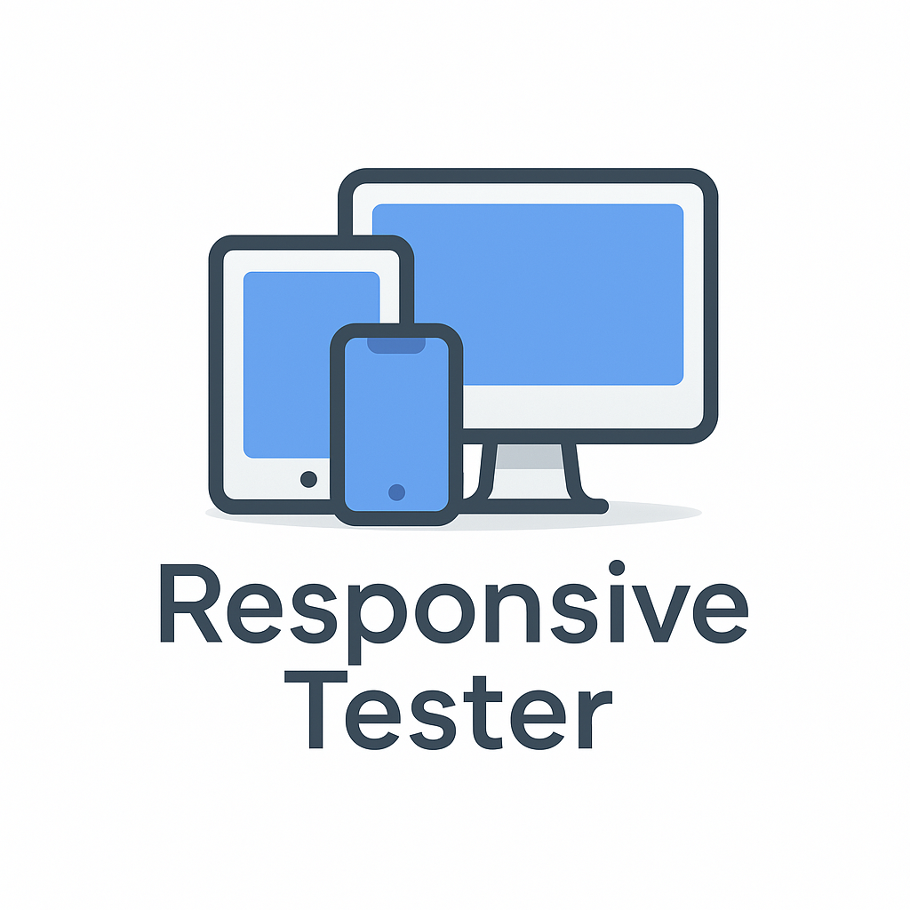
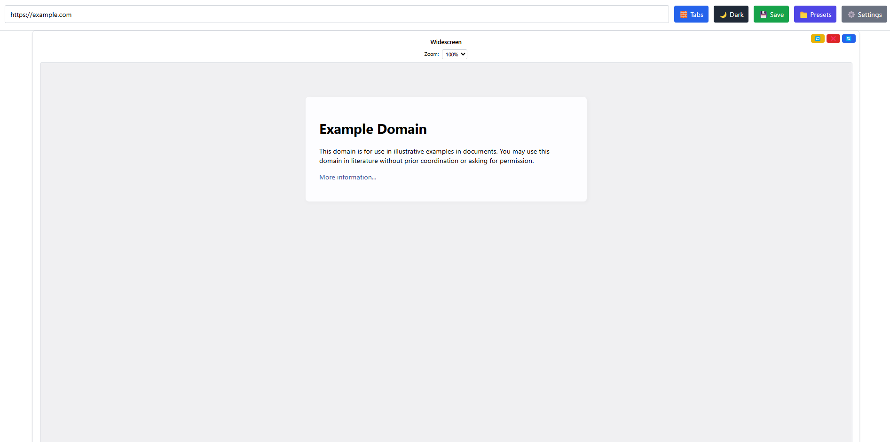

<p align="center">
  
</p>

# 🌐 Responsive Tester

A modern developer tool to preview websites across multiple devices in real-time. Easily test responsive layouts with device frames, zoom levels, themes, and preset management — all in one clean interface.



---

## ✨ Features

- 📱 **Device Frame Preview**  
  Test any URL across mobile, tablet, desktop, widescreen — side by side or in tab mode.

- ⚙️ **Per-Device Zoom & Orientation**  
  Set zoom level and rotate individual devices on the fly.

- 🎨 **Dark Mode + Fit to Width**  
  Theme-aware UI with automatic dark mode support.

- 💾 **Preset Management**  
  Save and load full layout configurations with custom devices.

- 🔁 **Import / Export Layouts**  
  Share JSON-based presets or archive your testing configurations.

- 🔧 **Settings Panel**
  Set default zoom, theme, layout behaviors, and reset all with one click.

- 🔥 **Toast Notifications**
  Smooth user feedback using [react-hot-toast](https://react-hot-toast.com)

- 📸 **One-click Screenshots**
  Capture any device frame and automatically download the image while copying it to your clipboard.

---

## 📦 Tech Stack

- **Frontend:** React + TypeScript + Tailwind CSS  
- **State:** `usePersistedState` + LocalStorage  
- **UI Utilities:** react-hot-toast  
- **Build Tool:** Vite  
- **Modularity:** Fully componentized (Toolbar, PresetModal, DeviceRenderer, etc.)

---

## 🚀 Getting Started

### 1. Clone the Repo

```bash
git clone https://github.com/progesor/responsive-tester.git
cd responsive-tester
```

### 2. Install Dependencies

```bash
npm install
```

### 3. Start the App

```bash
npm run dev
```

### 4. Build & Preview the PWA

```bash
npm run build
npm run preview
```

The preview server runs the production build with the PWA service worker
enabled. Open the printed URL in your browser and you should see an option
to install the app.

---

## 🗺️ Roadmap

| Status | Feature |
|--------|---------|
| ✅ | Grid/Tab layout switching |
| ✅ | Zoom & Rotate per device |
| ✅ | Dark mode + Fit-to-width |
| ✅ | Save / Load / Export / Import presets |
| ✅ | Combined modal-based preset manager |
| ✅ | Custom device creation |
| ✅ | Settings panel for default preferences |
| ✅ | Auto-reload iframe toggle |
| ✅ | Enhanced screenshot capability |
| ⏳ | Electron version (Desktop App) |
| ⏳ | PWA support (Installable Web App) |
| ⏳ | AI prompt assistance for breakpoints |
| ⏳ | Snapshot report builder |
| ⏳ | URL query-based preset sharing |

---

## 📂 Folder Structure

```
src/
├── components/         // Toolbar, PresetModal, DeviceFrame, etc.
├── hooks/              // usePersistedState.ts
├── types/              // Device & Preset interfaces
├── pages/              // PreviewPage.tsx (main view)
├── assets/             // Optional images or logos
```

---

## 📸 Screenshots

Click the **📸** icon on any device frame to instantly grab a screenshot. The image downloads and is copied to your clipboard for quick sharing.

---

## 👨‍💻 Contributing

Contributions are welcome! If you have ideas for enhancements or features, feel free to fork the repo and submit a pull request.

---

## 📝 License

MIT — Feel free to use, modify, and share.

---

## 🤝 Credits

Made with ❤️ by [@progesor](https://github.com/progesor)  
Inspired by the need to test responsive sites faster and better.

